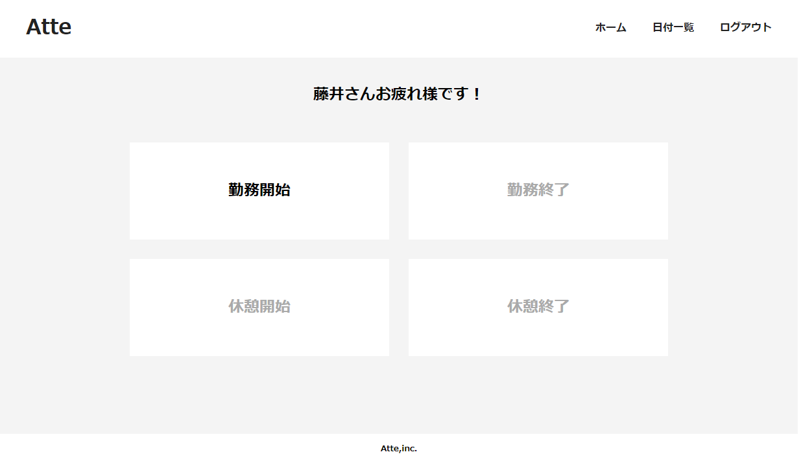
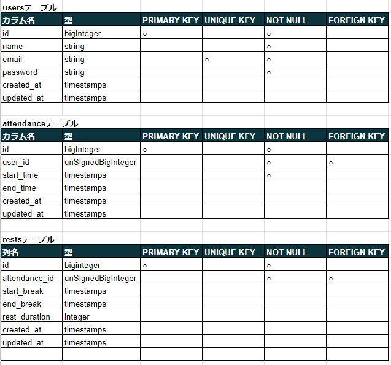
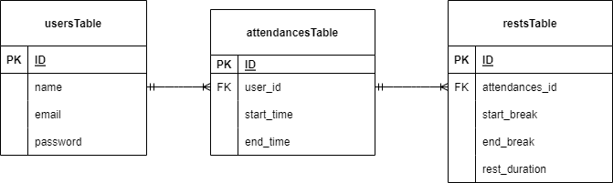
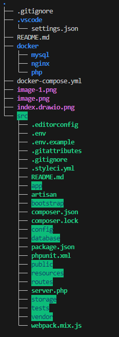

# Atte
勤怠管理アプリ

## 作成した目的
勤怠管理を円滑に、かつ正確に行うため。

## アプリケーションURL
35.75.29.180

## 機能一覧
- 会員登録
- ログイン
- 勤務開始・終了ボタン
- 休憩開始・終了ボタン
- 日付別勤怠管理
- ユーザー一覧勤怠管理

## 使用技術(実行環境)
- Laravel 8.83.27
- PHP 7.4.9
- mysql 8.0.26

## テーブル設計

## ER図

# 環境構築
$ git clone git@github.com:fujita-ryouhei/Atte.git

 githubでリモートリポジトリを作成した後、クローンしたリポジトリに移動して

$git remote set-url origin 作成したリポジトリのurl 
$git remote -v 
最後のコマンドで、変更先の url が表示されれば成功。  
$ git add . 
$ git commit -m "リモートリポジトリの変更" 
$ git push origin main 
上記のコマンドで、現在のローカルリポジトリのデータをリモートリポジトリに反映させます。  

続いてDockerの設定を行なっていきます。以下のコマンドを入力してください。 
$ docker-compose up -d --build 
実行が終わったら、「Docker Desktop for Mac」を確認して、コンテナが作成されていれば成功です。  

次にdocker-composeコマンドで PHPコンテナ内にログインしましょう。 
docker-compose exec php bash  
ログインができたら、composerコマンドを使って必要なパッケージをインストールします。 
composer install  

最後に、データベースに接続するために.envファイルを作成します。 
.envファイルは、.env.exampleファイルをコピーして作成しましょう。 
$ cp .env.example .env 
作成出来たら、.envファイルを以下のように編集します。  
.envファイル  
// 前略  
DB_CONNECTION=mysql 
DB_HOST=mysql 
DB_PORT=3306 
DB_DATABASE=laravel_db 
DB_USERNAME=laravel_user 
DB_PASSWORD=laravel_pass  
// 後略  

以下のアドレスに入るとデータベースが存在しているか確認ができます。

http://localhost:8080/ 

以上で環境構築は完了です。  

## ディレクトリ構成

